# Concert Ticket Management System - Design Document

## Table of Contents
1. [Document Information](#document-information)
2. [System Overview](#system-overview)
3. [Architecture Design](#architecture-design)
4. [System Components](#system-components)
5. [Data Models](#data-models)
6. [API Design](#api-design)
7. [Cache Strategy](#cache-strategy)
8. [Database Design](#database-design)

## Document Information

| **Field** | **Value** |
|-----------|-----------|
| **Document Title** | Concert Ticket Management System Design Document |
| **Version** | 1.0 |
| **Date** | May 3 2025 |
| **Author** | Jerrick Lewis |
| **Status** | Current |
| **Technology Stack** | ASP.NET Core 9.0, C#, Entity Framework Core, SQLite, IMemoryCache, FluentValidation |
| **Diagrams** | Mermaid format for enhanced readability and maintainability |

## System Overview

### Purpose
The Concert Ticket Management System is a comprehensive .NET Web API designed to handle concert event management, ticket reservations, and sales with real-time capacity management. The system implements a sophisticated cache-based reservation architecture that provides high performance, scalability, and automatic expiry handling.

### Key Features
- **Event Management**: Create, update, and manage concert events with multiple ticket types
- **Cache-Based Reservations**: 15-minute reservation windows using in-memory cache with TTL
- **Real-Time Availability**: Cache-aware availability tracking with automatic updates
- **Secure Transactions**: Thread-safe operations preventing overselling
- **Automatic Expiry**: Zero-maintenance reservation cleanup via cache TTL
- **Persistent Storage**: Only confirmed purchases are saved to database
- **Comprehensive API**: RESTful endpoints with Swagger documentation

### Business Goals
- Provide a scalable, efficient ticket reservation system
- Minimize database load for temporary operations
- Ensure data integrity and prevent overselling
- Deliver excellent user experience with fast response times
- Support high-traffic scenarios with automatic scaling

## Architecture Design

### System Architecture Overview

```mermaid
flowchart TD
    A["Client Layer\nWeb Browsers | Mobile Apps | Postman/API Clients"]
    B["API Gateway Layer\nASP.NET Core Web API Controllers\n• EventsController • TicketsController"]
    C["Business Logic Layer\n• EventService • TicketService\n• Validation Logic • Business Rules"]
    D["Cache Layer\nIMemoryCache (TTL-based)\n• Ticket Reservations\n• Availability Cache\n• 15-minute TTL\n• Auto-expiry Callbacks"]
    E["Persistence Layer\nEntity Framework Core\nSQLite Database\n• Purchased Tickets\n• Events & Ticket Types\n• Audit Trail"]

    A --> B
    B --> C
    C --> D
    C --> E
```



### Two-Tier Architecture

The system implements a sophisticated **two-tier persistence strategy**:

#### Tier 1: In-Memory Cache (Temporary Operations)
- **Technology**: .NET IMemoryCache with TTL
- **Purpose**: Fast, temporary ticket reservations
- **Duration**: 15-minute automatic expiry
- **Benefits**: High performance, automatic cleanup, reduced database load

#### Tier 2: SQLite Database (Persistent Operations)  
- **Technology**: Entity Framework Core with SQLite
- **Purpose**: Confirmed ticket purchases and event data
- **Benefits**: ACID transactions, data persistence, audit trail

### Design Patterns

| **Pattern** | **Usage** | **Benefit** |
|-------------|-----------|-------------|
| **Repository Pattern** | Data access abstraction | Testability, maintainability |
| **Service Layer Pattern** | Business logic separation | Single responsibility, modularity |
| **Dependency Injection** | Loose coupling | Testability, flexibility |
| **Cache-Aside Pattern** | Availability management | Performance, consistency |

## System Components

### Controllers

#### EventsController
- **Responsibility**: Event management endpoints
- **Key Methods**:
  - `GET /api/events` - List all events
  - `GET /api/events/{id}` - Get specific event
  - `GET /api/events/{id}/availability` - Real-time availability
  - `POST /api/events` - Create new event
  - `PUT /api/events/{id}` - Update event
  - `DELETE /api/events/{id}` - Soft delete event

#### TicketsController  
- **Responsibility**: Ticket reservation and purchase endpoints
- **Key Methods**:
  - `POST /api/tickets/reserve` - Create cache-based reservation
  - `GET /api/tickets/reservation/{id}` - Get cached reservation details
  - `DELETE /api/tickets/reservation/{id}` - Cancel reservation from cache
  - `POST /api/tickets/purchase` - Move from cache to database
  - `GET /api/tickets/{id}` - Get purchased ticket details
  

### Services

#### EventService
- **Responsibility**: Event business logic
- **Key Functions**:
  - Event creation and validation
  - Capacity management
  - Ticket type configuration
  - Business rule enforcement

#### TicketService
- **Responsibility**: Ticket reservation and purchase logic
- **Key Functions**:
  - Cache-based reservation management
  - Availability tracking with cache integration
  - Purchase transaction processing
  - Automatic expiry handling via TTL
  - Thread-safe operations

### Data Access Layer

#### ConcertTicketContext
- **Technology**: Entity Framework Core
- **Database**: SQLite
- **Responsibilities**:
  - Entity configuration and relationships
  - Database migrations
  - Transaction management
  - Query optimization

## Data Models

### Core Entities

#### Event
```csharp
public class Event
{
    public int Id { get; set; }
    public string Title { get; set; }
    public string Description { get; set; }
    public DateTime EventDate { get; set; }
    public string Venue { get; set; }
    public string VenueAddress { get; set; }
    public int TotalCapacity { get; set; }
    public int AvailableCapacity { get; set; }
    public bool IsActive { get; set; }
    public DateTime CreatedAt { get; set; }
    public DateTime UpdatedAt { get; set; }
    
    // Navigation Properties
    public virtual ICollection<TicketType> TicketTypes { get; set; }
    public virtual ICollection<Ticket> Tickets { get; set; }
}
```

#### TicketType
```csharp
public class TicketType
{
    public int Id { get; set; }
    public int EventId { get; set; }
    public string Name { get; set; }
    public string Description { get; set; }
    public decimal Price { get; set; }
    public int Capacity { get; set; }
    public int AvailableCount { get; set; }
    public bool IsActive { get; set; }
    public DateTime CreatedAt { get; set; }
    public DateTime UpdatedAt { get; set; }
    
    // Navigation Properties
    public virtual Event Event { get; set; }
    public virtual ICollection<Ticket> Tickets { get; set; }
}
```

#### Ticket (Database Entity)
```csharp
public class Ticket
{
    public int Id { get; set; }
    public int EventId { get; set; }
    public int TicketTypeId { get; set; }
    public string CustomerName { get; set; }
    public string CustomerEmail { get; set; }
    public string CustomerPhone { get; set; }
    public TicketStatus Status { get; set; } // Purchased, Cancelled
    public decimal Price { get; set; }
    public DateTime ReservedAt { get; set; }
    public DateTime? PurchasedAt { get; set; }
    public DateTime? CancelledAt { get; set; }
    public string Notes { get; set; }
    public string TicketNumber { get; set; }
    public DateTime CreatedAt { get; set; }
    public DateTime UpdatedAt { get; set; }
    
    // Navigation Properties
    public virtual Event Event { get; set; }
    public virtual TicketType TicketType { get; set; }
}
```

#### CachedReservation (Cache Entity)
```csharp
public class CachedReservation
{
    public string ReservationId { get; set; }
    public int EventId { get; set; }
    public int TicketTypeId { get; set; }
    public int Quantity { get; set; }
    public string CustomerName { get; set; }
    public string CustomerEmail { get; set; }
    public string CustomerPhone { get; set; }
    public decimal PricePerTicket { get; set; }
    public DateTime ReservedAt { get; set; }
    public DateTime ExpiresAt { get; set; }
    public string Notes { get; set; }
    public List<string> TicketNumbers { get; set; }
    
    // Computed Properties
    public decimal TotalPrice => PricePerTicket * Quantity;
    public bool IsExpired => DateTime.UtcNow >= ExpiresAt;
    public TimeSpan TimeRemaining => ExpiresAt - DateTime.UtcNow;
}
```

### Entity Relationships


## API Design

### RESTful API Principles

The API follows REST architectural principles with clear resource-based URLs, appropriate HTTP methods, and standard status codes.

### Endpoint Categories

#### Event Management
| Method | Endpoint | Purpose | Cache Impact |
|--------|----------|---------|--------------|
| GET | `/api/events` | List events | Read-only |
| GET | `/api/events/{id}` | Get event details | Read-only |
| GET | `/api/events/{id}/availability` | Real-time availability | Cache-aware |
| POST | `/api/events` | Create event | Cache refresh |
| PUT | `/api/events/{id}` | Update event | Cache invalidation |
| DELETE | `/api/events/{id}` | Delete event | Cache cleanup |

#### Ticket Operations
| Method | Endpoint | Purpose | Data Flow |
|--------|----------|---------|-----------|
| POST | `/api/tickets/reserve` | Create reservation | → Cache |
| GET | `/api/tickets/reservation/{id}` | Get reservation | Cache → Response |
| DELETE | `/api/tickets/reservation/{id}` | Cancel reservation | Cache removal + Availability restore |
| POST | `/api/tickets/purchase` | Complete purchase | Cache → Database |
| GET | `/api/tickets/{id}` | Get ticket details | Database → Response |


### Request/Response Models

#### Reserve Ticket Request
```json
{
  "eventId": 1,
  "ticketTypeId": 2,
  "quantity": 2,
  "customerName": "John Doe",
  "customerEmail": "john@example.com",
  "customerPhone": "+1234567890",
  "notes": "Special occasion"
}
```

#### Reservation Response
```json
{
  "success": true,
  "message": "Successfully reserved 2 ticket(s)",
  "reservationId": "RES_20241203123456_A2B3C4D5",
  "tickets": [...],
  "expiresAt": "2024-12-03T12:49:56Z",
  "totalPrice": 150.00,
  "timeRemaining": "00:14:59"
}
```

#### Purchase Request
```json
{
  "reservationId": "RES_20241203123456_A2B3C4D5",
  "paymentReference": "PAY_123456789",
  "notes": "Payment processed successfully"
}
```

### API Configuration

#### Base URL
- **Development**: `http://localhost:5263` (port may vary)
- **Swagger UI**: Available at root URL during development
- **API Endpoints**: All endpoints prefixed with `/api/`

#### Validation Framework
The API uses **FluentValidation.AspNetCore** for comprehensive input validation:
- **Automatic Model Validation**: Applied to all DTOs
- **Custom Business Rules**: Implemented in service layer
- **Detailed Error Messages**: Clear validation feedback
- **Range Validation**: Quantity limits (1-10 tickets per reservation)
- **Email Validation**: RFC-compliant email address validation
- **String Length Limits**: Prevents oversized inputs

### Smart Delete Strategy

The system implements an intelligent delete strategy for events that automatically chooses between hard and soft delete based on business context.

#### Delete Logic Implementation

```csharp
public async Task<bool> DeleteEventAsync(int id)
{
    var eventEntity = await _context.Events.FindAsync(id);
    if (eventEntity == null) return false;

    // Check if there are any sold tickets
    var hasSoldTickets = await _context.Tickets
        .AnyAsync(t => t.EventId == id && t.Status == TicketStatus.Purchased);

    if (hasSoldTickets)
    {
        // Soft delete - mark as inactive instead of deleting
        eventEntity.IsActive = false;
        eventEntity.UpdatedAt = DateTime.UtcNow;
        await _context.SaveChangesAsync();
        return true;
    }

    // Hard delete if no sold tickets
    _context.Events.Remove(eventEntity);
    await _context.SaveChangesAsync();
    return true;
}
```

#### Conditional Delete Behavior

| **Event State** | **Delete Type** | **Action** | **Rationale** |
|----------------|----------------|------------|---------------|
| **No Sold Tickets** | Hard Delete | Permanent removal | Clean up unused data |
| **Has Sold Tickets** | Soft Delete | Mark `IsActive = false` | Preserve customer records |

#### Business Rationale for Soft Delete

##### **🎫 Data Integrity & Legal Compliance**
- **Customer Records**: Purchased tickets are legal contracts requiring data preservation
- **Financial Audit Trail**: Revenue records must be maintained for accounting/tax compliance
- **Refund Processing**: Event data needed for potential refunds and chargebacks
- **Legal Requirements**: Many jurisdictions mandate transaction record retention

##### **🎫 Customer Service Excellence**
- **Ticket Validation**: Customers need access to purchased tickets on event day
- **Purchase History**: Users can view complete ticket history including cancelled events
- **Support Operations**: Customer service requires event details for assistance
- **Digital Tickets**: QR codes and ticket numbers remain valid

##### **🎫 Business Intelligence & Analytics**
- **Revenue Analysis**: Track sales performance across all events (including cancelled)
- **Venue Analytics**: Understand event success patterns and venue performance
- **Customer Behavior**: Analyze purchasing patterns and preferences
- **Financial Reporting**: Complete historical data for business reporting

##### **🎫 Technical Integrity**
- **Foreign Key Constraints**: Tickets reference events - deletion would break relationships
- **Database Consistency**: Maintains referential integrity across all tables
- **Audit Trail**: Complete operational history for system monitoring
- **Data Recovery**: Ability to reactivate events if cancellation is reversed

#### Soft Delete Implementation Details

##### **Event Filtering Logic**
The system automatically filters inactive events in most operations:

```csharp
// Public event listings - exclude inactive events
if (!includeInactive)
{
    query = query.Where(e => e.IsActive);
}

// Upcoming events - only active future events
.Where(e => e.IsActive && e.EventDate > DateTime.UtcNow)

// Ticket reservations - prevent new bookings
if (!ticketType.Event.IsActive || ticketType.Event.EventDate <= DateTime.UtcNow)
{
    return new ReservationResponse
    {
        Success = false,
        Message = "Event is not available for booking."
    };
}
```

##### **Admin Access to Inactive Events**
Administrators can access inactive events using the `includeInactive=true` parameter:

```bash
# Public view - only active events
GET /api/events

# Admin view - all events including inactive
GET /api/events?includeInactive=true
```

##### **Customer Data Preservation**
After soft delete, customers retain full access to their purchased tickets:
- ✅ Ticket details remain accessible via `/api/tickets/{id}`
- ✅ Customer history includes cancelled event tickets
- ✅ Digital tickets remain valid for validation
- ✅ Refund processing can access complete event information

#### Real-World Example

**Scenario**: "Rock Concert 2024" cancelled due to weather - 500 tickets already sold

**With Hard Delete** ❌:
- Event data permanently lost
- Customer tickets become orphaned records
- Refund processing impossible
- Customer service cannot assist ticket holders
- Financial audit trail incomplete
- Legal compliance violated

**With Soft Delete** ✅:
- Event marked `IsActive = false`
- Customer tickets remain fully accessible
- Refund processing retains complete event context
- Customer service has full support capabilities
- Complete audit trail preserved
- Legal and financial compliance maintained
- Business can analyze cancellation impact

#### Benefits Summary

| **Aspect** | **Benefit** |
|------------|-------------|
| **User Experience** | Events disappear from public view but customer data remains |
| **Data Safety** | Zero risk of losing critical business data |
| **Compliance** | Meets legal requirements for record retention |
| **Operations** | Enables customer service and business analysis |
| **Recovery** | Events can be reactivated if cancellation is reversed |
| **Integrity** | Maintains database relationships and constraints |

This intelligent delete strategy ensures the system maintains **data integrity**, **customer trust**, and **business continuity** while providing a clean user experience for active events.

## Cache Strategy

### Cache Architecture

The system implements a sophisticated caching strategy using .NET IMemoryCache with TTL-based automatic expiry and eviction callbacks.

### Cache Types

#### 1. Reservation Cache
- **Purpose**: Store temporary ticket reservations
- **Key Pattern**: `reservation_{reservationId}`
- **TTL**: 15 minutes (absolute expiration)
- **Eviction Callback**: Automatic availability restoration when reservations expire
- **Priority**: High (CacheItemPriority.High)

#### 2. Availability Cache  
- **Purpose**: Cache ticket availability counts
- **Key Pattern**: `availability_{ticketTypeId}`
- **TTL**: 5 minutes (sliding expiration)
- **Update Strategy**: Cache-aside pattern
- **Priority**: Normal (CacheItemPriority.Normal)

### TTL and Callback Strategy

The cache uses a **dual mechanism** for reservation management:

1. **TTL (Time-To-Live)**: Automatically removes expired reservations from cache after 15 minutes
2. **Eviction Callback**: Executes custom logic when TTL expires, specifically restoring ticket availability

**Why both are needed:**
- **TTL**: Ensures reservations are automatically cleaned up (zero maintenance)
- **Callback**: Allows availability restoration when reservations expire (business logic)
- **Together**: Provides automatic reservation expiry with proper availability management

### Cache Operations


### Cache Performance

| **Metric** | **Value** | **Benefit** |
|------------|-----------|-------------|
| **Reservation Access** | O(1) | Instant retrieval |
| **Memory Usage** | Self-managing | Auto cleanup |
| **Expiry Handling** | Automatic | Zero maintenance |
| **Concurrency** | Thread-safe | Multi-user support |

## Database Design

### Database Selection: SQLite

#### Rationale
- **Zero Configuration**: No server installation required
- **Cross-Platform**: Works on Windows, Mac, Linux
- **ACID Compliance**: Full transaction support
- **File-Based**: Single file database
- **Entity Framework Integration**: Seamless ORM support

### Schema Design

#### Tables

```sql
-- Events Table
CREATE TABLE Events (
    Id INTEGER PRIMARY KEY AUTOINCREMENT,
    Title NVARCHAR(200) NOT NULL,
    Description NVARCHAR(1000),
    EventDate DATETIME NOT NULL,
    Venue NVARCHAR(200) NOT NULL,
    VenueAddress NVARCHAR(500),
    TotalCapacity INTEGER NOT NULL,
    AvailableCapacity INTEGER NOT NULL,
    IsActive BOOLEAN NOT NULL DEFAULT 1,
    CreatedAt DATETIME NOT NULL,
    UpdatedAt DATETIME NOT NULL
);

-- TicketTypes Table
CREATE TABLE TicketTypes (
    Id INTEGER PRIMARY KEY AUTOINCREMENT,
    EventId INTEGER NOT NULL,
    Name NVARCHAR(100) NOT NULL,
    Description NVARCHAR(500),
    Price DECIMAL(18,2) NOT NULL,
    Capacity INTEGER NOT NULL,
    AvailableCount INTEGER NOT NULL,
    IsActive BOOLEAN NOT NULL DEFAULT 1,
    CreatedAt DATETIME NOT NULL,
    UpdatedAt DATETIME NOT NULL,
    FOREIGN KEY (EventId) REFERENCES Events(Id)
);

-- Tickets Table  
CREATE TABLE Tickets (
    Id INTEGER PRIMARY KEY AUTOINCREMENT,
    EventId INTEGER NOT NULL,
    TicketTypeId INTEGER NOT NULL,
    CustomerName NVARCHAR(100) NOT NULL,
    CustomerEmail NVARCHAR(200) NOT NULL,
    CustomerPhone NVARCHAR(20),
    Status NVARCHAR(20) NOT NULL,
    Price DECIMAL(18,2) NOT NULL,
    ReservedAt DATETIME NOT NULL,
    PurchasedAt DATETIME,
    CancelledAt DATETIME,
    Notes NVARCHAR(500),
    TicketNumber NVARCHAR(50) NOT NULL,
    CreatedAt DATETIME NOT NULL,
    UpdatedAt DATETIME NOT NULL,
    FOREIGN KEY (EventId) REFERENCES Events(Id),
    FOREIGN KEY (TicketTypeId) REFERENCES TicketTypes(Id)
);
```

#### Indexes

```sql
-- Performance Indexes
CREATE INDEX IX_Events_EventDate ON Events(EventDate);
CREATE INDEX IX_Events_Venue ON Events(Venue);
CREATE INDEX IX_TicketTypes_EventId ON TicketTypes(EventId);
CREATE INDEX IX_Tickets_EventId ON Tickets(EventId);
CREATE INDEX IX_Tickets_CustomerEmail ON Tickets(CustomerEmail);
CREATE INDEX IX_Tickets_TicketNumber ON Tickets(TicketNumber);
CREATE INDEX IX_Tickets_Status ON Tickets(Status);
```

---

## Conclusion

The Concert Ticket Management System represents a modern, scalable solution for event ticketing with innovative cache-based architecture. The two-tier persistence strategy provides excellent performance while maintaining data integrity, and the comprehensive API design supports both current needs and future enhancements.

The system's architecture is designed for growth, with clear separation of concerns, modern technology choices, and proven design patterns that will support the planned feature roadmap and scale to meet increasing demand.

**Document Version**: 1.0  
**Last Updated**: June 2025